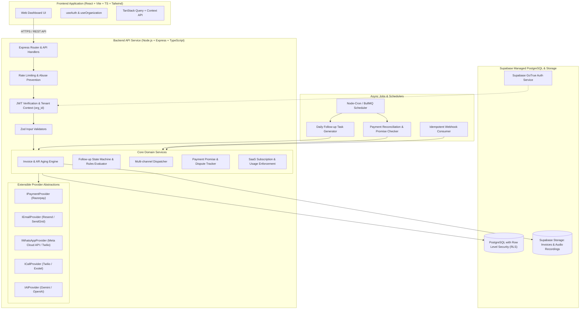
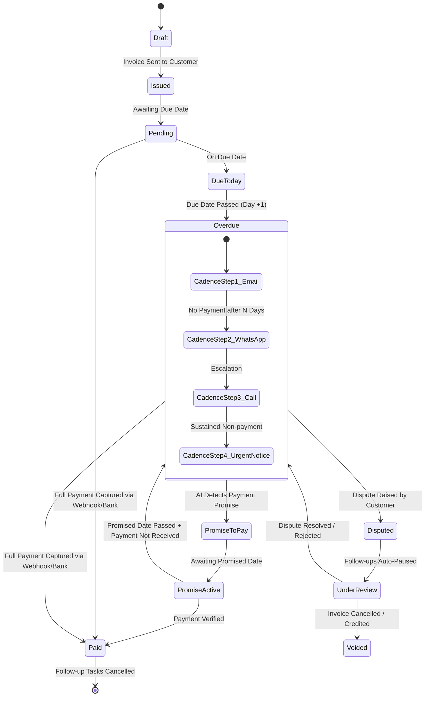

# PayPilot - Architecture Specification

## 1. System Overview

PayPilot is a cloud-native, multi-tenant B2B Accounts Receivable (AR) automation and payment recovery platform. It automates the end-to-end lifecycle of invoice tracking, customer communication across multiple channels (Email, WhatsApp, Voice Calls), payment promise detection via AI, reconciliation, and dispute management.



---

## 2. Multi-Tenant Architecture & Isolation

### 2.1 Tenant Hierarchy
1. **User (Profile)**: A registered individual authenticated via Supabase Auth (`auth.users`).
2. **Organization**: A business entity (Tenant). Owns customers, invoices, follow-up rules, and payment gateways.
3. **Organization Member**: Maps users to organizations with role-based access control (`owner`, `admin`, `member`, `viewer`).
4. **Tenant Isolation Guarantee**:
   - Every domain table contains an `organization_id` foreign key.
   - All database access enforces Supabase **Row Level Security (RLS)**.
   - The backend **never** trusts client-supplied `organization_id` in request payloads for write operations.
   - Tenant context is resolved server-side from the authenticated user's verified JWT and validated against `organization_members`.

---

## 3. Provider Abstractions & Interfaces

All third-party integrations adhere to strictly typed, dependency-injected interfaces to eliminate vendor lock-in and enable deterministic testing.

### 3.1 Payment Provider Abstraction (`IPaymentProvider`)

```typescript
export interface PaymentLinkRequest {
  organizationId: string;
  invoiceId: string;
  amount: number; // in minor units (e.g., paise/cents)
  currency: string;
  customerName: string;
  customerEmail: string;
  customerPhone?: string;
  description: string;
  dueDate: Date;
  expiryDate?: Date;
  callbackUrl?: string;
}

export interface PaymentLinkResponse {
  providerLinkId: string;
  shortUrl: string;
  qrCodeUrl?: string;
  status: 'created' | 'paid' | 'expired' | 'cancelled';
  rawResponse: Record<string, unknown>;
}

export interface WebhookVerificationResult {
  isValid: boolean;
  event: 'payment.captured' | 'payment.failed' | 'payment_link.paid' | 'unknown';
  paymentId?: string;
  orderId?: string;
  paymentLinkId?: string;
  amount?: number;
  currency?: string;
  rawPayload: Record<string, unknown>;
}

export interface IPaymentProvider {
  createPaymentLink(params: PaymentLinkRequest): Promise<PaymentLinkResponse>;
  cancelPaymentLink(providerLinkId: string): Promise<boolean>;
  verifyWebhookSignature(rawBody: string | Buffer, signature: string, secret: string): Promise<WebhookVerificationResult>;
  fetchPaymentDetails(paymentId: string): Promise<{
    status: 'captured' | 'failed' | 'refunded';
    amount: number;
    method: string;
    paidAt: Date;
  }>;
}
```

### 3.2 Communication Provider Abstractions

#### Email Provider (`IEmailProvider`)
```typescript
export interface EmailPayload {
  to: string;
  from?: string;
  subject: string;
  html: string;
  text?: string;
  replyTo?: string;
  attachments?: Array<{
    filename: string;
    content: Buffer | string;
    contentType: string;
  }>;
  trackingId?: string;
}

export interface EmailDeliveryResult {
  messageId: string;
  status: 'queued' | 'sent' | 'failed';
  timestamp: Date;
}

export interface IEmailProvider {
  sendEmail(payload: EmailPayload): Promise<EmailDeliveryResult>;
}
```

#### WhatsApp Provider (`IWhatsAppProvider`)
```typescript
export interface WhatsAppTemplatePayload {
  to: string; // E.164 format (+919876543210)
  templateName: string;
  languageCode: string;
  parameters: Array<{
    type: 'text' | 'currency' | 'date_time' | 'document';
    value: string;
  }>;
  mediaUrl?: string;
  paymentLinkUrl?: string;
}

export interface WhatsAppDirectMessagePayload {
  to: string;
  body: string;
}

export interface WhatsAppDeliveryResult {
  providerMessageId: string;
  status: 'accepted' | 'sent' | 'delivered' | 'failed';
  timestamp: Date;
}

export interface IWhatsAppProvider {
  sendTemplateMessage(payload: WhatsAppTemplatePayload): Promise<WhatsAppDeliveryResult>;
  sendTextMessage(payload: WhatsAppDirectMessagePayload): Promise<WhatsAppDeliveryResult>;
  verifyWebhookSignature(rawBody: string | Buffer, signature: string): boolean;
}
```

#### Call Provider (`ICallProvider`)
```typescript
export interface OutboundCallRequest {
  to: string;
  from?: string;
  scriptText?: string;
  audioUrl?: string;
  recordCall?: boolean;
  callbackUrl?: string;
  metadata?: Record<string, string>;
}

export interface OutboundCallResponse {
  providerCallId: string;
  status: 'queued' | 'ringing' | 'in-progress' | 'completed' | 'busy' | 'no-answer' | 'failed';
  timestamp: Date;
}

export interface ICallProvider {
  initiateOutboundCall(request: OutboundCallRequest): Promise<OutboundCallResponse>;
  fetchCallRecording(providerCallId: string): Promise<{ audioBuffer: Buffer; durationSeconds: number } | null>;
}
```

### 3.3 AI Provider Abstraction (`IAIProvider`)

```typescript
export interface AnalyzeCommunicationInput {
  channel: 'email' | 'whatsapp' | 'call_transcript';
  rawContent: string;
  invoiceContext: {
    invoiceNumber: string;
    amountDue: number;
    currency: string;
    dueDate: string;
  };
}

export interface CommunicationAnalysisResult {
  sentiment: 'positive' | 'neutral' | 'frustrated' | 'disputing';
  intent: 'promise_to_pay' | 'dispute' | 'request_extension' | 'already_paid' | 'unrelated' | 'opt_out';
  paymentPromise?: {
    detected: boolean;
    promisedDate?: string; // ISO 8601 YYYY-MM-DD
    promisedAmount?: number;
    confidenceScore: number; // 0.0 to 1.0
  };
  dispute?: {
    detected: boolean;
    reasonSummary?: string;
    category?: 'wrong_amount' | 'service_issue' | 'tax_discrepancy' | 'invoice_missing' | 'other';
  };
  recommendedNextAction: 'pause_followup' | 'escalate_to_human' | 'send_payment_link' | 'continue_cadence';
  suggestedReplyText: string;
}

export interface IAIProvider {
  analyzeCustomerReply(input: AnalyzeCommunicationInput): Promise<CommunicationAnalysisResult>;
  generatePersonalizedReminder(context: {
    customerName: string;
    invoiceNumber: string;
    amount: number;
    currency: string;
    daysOverdue: number;
    paymentLink: string;
    tone: 'gentle' | 'formal' | 'urgent' | 'legal_notice';
  }): Promise<{ subject: string; body: string }>;
}
```

---

## 4. Autonomous Follow-up State Machine & Workflow



### 4.1 Follow-up Rules Engine Logic
- **Triggers**: Relative offsets from Invoice Due Date:
  - `-3 days` (Upcoming payment reminder via Email)
  - `0 days` (Due date reminder via WhatsApp / Email)
  - `+3 days` (Soft overdue notice via WhatsApp)
  - `+7 days` (Formal overdue reminder + payment link via Email & WhatsApp)
  - `+14 days` (Automated IVR/Voice Follow-up Call or Human escalation task)
  - `+30 days` (High-priority notice & legal demand warning)
- **Circuit Breakers (Auto-Stop)**:
  - **Payment Received**: Invoice status becomes `paid` or `partially_paid` (if configured). All pending `follow_up_tasks` are immediately cancelled.
  - **Active Payment Promise**: When an AI promise is validated with a future date, follow-ups are frozen until `promised_date + grace_period` (default 24 hours).
  - **Active Dispute**: Invoice marked `disputed`. Auto-reminders frozen until merchant manually resolves or overrides.
  - **Customer Opt-Out**: Customer marks DND / unsubscribes.

---

## 5. Subscription & Usage Limit Enforcement

PayPilot operates on tiered SaaS pricing (e.g. Free/Starter, Growth, Scale, Enterprise).

| Feature / Limit | Starter | Growth | Scale / Enterprise |
| :--- | :--- | :--- | :--- |
| Active Invoices / Mo | 50 | 500 | Unlimited |
| Multi-channel (Email) | Included | Included | Included |
| WhatsApp Follow-ups | 100 msgs/mo | 1,000 msgs/mo | Custom pool |
| Voice Calls | Not Included | 100 calls/mo | Custom pool |
| AI Reply Analysis | 50 runs/mo | 500 runs/mo | Custom pool |
| Team Members | 2 | 10 | Unlimited |

### 5.1 Enforcement Middleware (`enforceUsageLimit`)
Before executing actions (e.g., sending WhatsApp, initiating Call, analyzing AI reply, adding invoice), the server checks:
1. Active subscription status (`active`, `trialing`).
2. Current month's `usage_records` count against `subscriptions.plan_tier` quota.
3. Rejects with `402 Payment Required` or `429 Quota Exceeded` with appropriate upgrade prompt if over limit.
