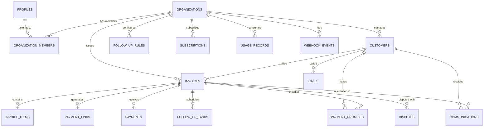

# PayPilot - Database Schema & Row Level Security (RLS) Specification

## 1. Schema Design Principles
1. **UUID Primary Keys**: Every table uses `gen_random_uuid()` default for distributed resilience and IDOR mitigation.
2. **Financial Precision**: Money amounts are strictly typed as `NUMERIC(15, 2)` (with currency code ISO-4217).
3. **Multi-Tenant Isolation**: Every non-global table strictly includes `organization_id UUID NOT NULL REFERENCES organizations(id) ON DELETE CASCADE`.
4. **Timezone Awareness**: All timestamp columns are `TIMESTAMPTZ` with `DEFAULT timezone('utc'::text, now())`.
5. **Auditability**: `created_at`, `updated_at`, and audit foreign keys (`created_by`) on all core business records.
6. **Strict Integrity**: Foreign keys, check constraints, composite unique constraints, and optimized indexes.

---

## 2. Entity-Relationship Diagram



---

## 3. Detailed DDL Specifications

```sql
-- Enable necessary extensions
CREATE EXTENSION IF NOT EXISTS "uuid-ossp";
CREATE EXTENSION IF NOT EXISTS "pgcrypto";

-- ============================================================================
-- 1. PROFILES (Extends Supabase auth.users)
-- ============================================================================
CREATE TABLE public.profiles (
    id UUID PRIMARY KEY REFERENCES auth.users(id) ON DELETE CASCADE,
    email TEXT NOT NULL UNIQUE,
    full_name TEXT NOT NULL,
    phone_number TEXT,
    avatar_url TEXT,
    created_at TIMESTAMPTZ NOT NULL DEFAULT timezone('utc'::text, now()),
    updated_at TIMESTAMPTZ NOT NULL DEFAULT timezone('utc'::text, now())
);

-- ============================================================================
-- 2. ORGANIZATIONS (Tenants)
-- ============================================================================
CREATE TABLE public.organizations (
    id UUID PRIMARY KEY DEFAULT gen_random_uuid(),
    name TEXT NOT NULL,
    slug TEXT NOT NULL UNIQUE,
    logo_url TEXT,
    currency VARCHAR(3) NOT NULL DEFAULT 'INR',
    timezone TEXT NOT NULL DEFAULT 'Asia/Kolkata',
    billing_address JSONB DEFAULT '{}'::jsonb,
    tax_id TEXT, -- GSTIN / VAT / EIN
    support_email TEXT,
    support_phone TEXT,
    created_by UUID REFERENCES public.profiles(id) ON DELETE SET NULL,
    created_at TIMESTAMPTZ NOT NULL DEFAULT timezone('utc'::text, now()),
    updated_at TIMESTAMPTZ NOT NULL DEFAULT timezone('utc'::text, now())
);

-- ============================================================================
-- 3. ORGANIZATION_MEMBERS (Tenant Membership & RBAC)
-- ============================================================================
CREATE TYPE member_role AS ENUM ('owner', 'admin', 'member', 'viewer');

CREATE TABLE public.organization_members (
    id UUID PRIMARY KEY DEFAULT gen_random_uuid(),
    organization_id UUID NOT NULL REFERENCES public.organizations(id) ON DELETE CASCADE,
    user_id UUID NOT NULL REFERENCES public.profiles(id) ON DELETE CASCADE,
    role member_role NOT NULL DEFAULT 'member',
    invited_email TEXT,
    status TEXT NOT NULL DEFAULT 'active' CHECK (status IN ('active', 'invited', 'suspended')),
    created_at TIMESTAMPTZ NOT NULL DEFAULT timezone('utc'::text, now()),
    updated_at TIMESTAMPTZ NOT NULL DEFAULT timezone('utc'::text, now()),
    UNIQUE(organization_id, user_id)
);

-- ============================================================================
-- 4. CUSTOMERS (Debtors / B2B Clients)
-- ============================================================================
CREATE TABLE public.customers (
    id UUID PRIMARY KEY DEFAULT gen_random_uuid(),
    organization_id UUID NOT NULL REFERENCES public.organizations(id) ON DELETE CASCADE,
    company_name TEXT NOT NULL,
    contact_name TEXT NOT NULL,
    email TEXT NOT NULL,
    phone TEXT,
    whatsapp_number TEXT,
    gstin TEXT,
    billing_address JSONB DEFAULT '{}'::jsonb,
    credit_period_days INTEGER NOT NULL DEFAULT 30 CHECK (credit_period_days >= 0),
    is_dnd BOOLEAN NOT NULL DEFAULT FALSE,
    notes TEXT,
    metadata JSONB DEFAULT '{}'::jsonb,
    created_at TIMESTAMPTZ NOT NULL DEFAULT timezone('utc'::text, now()),
    updated_at TIMESTAMPTZ NOT NULL DEFAULT timezone('utc'::text, now()),
    UNIQUE(organization_id, email)
);

-- ============================================================================
-- 5. INVOICES
-- ============================================================================
CREATE TYPE invoice_status AS ENUM (
    'draft',
    'issued',
    'pending',
    'partially_paid',
    'paid',
    'overdue',
    'disputed',
    'voided',
    'written_off'
);

CREATE TABLE public.invoices (
    id UUID PRIMARY KEY DEFAULT gen_random_uuid(),
    organization_id UUID NOT NULL REFERENCES public.organizations(id) ON DELETE CASCADE,
    customer_id UUID NOT NULL REFERENCES public.customers(id) ON DELETE RESTRICT,
    invoice_number TEXT NOT NULL,
    issue_date DATE NOT NULL,
    due_date DATE NOT NULL,
    currency VARCHAR(3) NOT NULL DEFAULT 'INR',
    subtotal NUMERIC(15, 2) NOT NULL CHECK (subtotal >= 0),
    tax_total NUMERIC(15, 2) NOT NULL DEFAULT 0.00 CHECK (tax_total >= 0),
    total_amount NUMERIC(15, 2) NOT NULL CHECK (total_amount >= 0),
    amount_paid NUMERIC(15, 2) NOT NULL DEFAULT 0.00 CHECK (amount_paid >= 0),
    amount_due NUMERIC(15, 2) NOT NULL CHECK (amount_due >= 0),
    status invoice_status NOT NULL DEFAULT 'draft',
    pdf_url TEXT,
    notes TEXT,
    terms_and_conditions TEXT,
    is_follow_up_active BOOLEAN NOT NULL DEFAULT TRUE,
    follow_up_paused_until TIMESTAMPTZ,
    last_follow_up_at TIMESTAMPTZ,
    next_follow_up_at TIMESTAMPTZ,
    created_by UUID REFERENCES public.profiles(id) ON DELETE SET NULL,
    created_at TIMESTAMPTZ NOT NULL DEFAULT timezone('utc'::text, now()),
    updated_at TIMESTAMPTZ NOT NULL DEFAULT timezone('utc'::text, now()),
    CONSTRAINT check_amount_integrity CHECK (amount_paid + amount_due = total_amount),
    UNIQUE(organization_id, invoice_number)
);

-- ============================================================================
-- 6. INVOICE_ITEMS
-- ============================================================================
CREATE TABLE public.invoice_items (
    id UUID PRIMARY KEY DEFAULT gen_random_uuid(),
    invoice_id UUID NOT NULL REFERENCES public.invoices(id) ON DELETE CASCADE,
    description TEXT NOT NULL,
    quantity NUMERIC(10, 3) NOT NULL DEFAULT 1.000 CHECK (quantity > 0),
    unit_price NUMERIC(15, 2) NOT NULL CHECK (unit_price >= 0),
    tax_rate NUMERIC(5, 2) NOT NULL DEFAULT 0.00 CHECK (tax_rate >= 0),
    tax_amount NUMERIC(15, 2) NOT NULL DEFAULT 0.00 CHECK (tax_amount >= 0),
    total NUMERIC(15, 2) NOT NULL CHECK (total >= 0),
    created_at TIMESTAMPTZ NOT NULL DEFAULT timezone('utc'::text, now())
);

-- ============================================================================
-- 7. PAYMENT_LINKS (Provider Agnostic / Razorpay Links)
-- ============================================================================
CREATE TYPE payment_link_status AS ENUM ('active', 'paid', 'expired', 'cancelled');

CREATE TABLE public.payment_links (
    id UUID PRIMARY KEY DEFAULT gen_random_uuid(),
    organization_id UUID NOT NULL REFERENCES public.organizations(id) ON DELETE CASCADE,
    invoice_id UUID NOT NULL REFERENCES public.invoices(id) ON DELETE CASCADE,
    provider TEXT NOT NULL DEFAULT 'razorpay',
    provider_link_id TEXT NOT NULL,
    short_url TEXT NOT NULL,
    qr_code_url TEXT,
    amount NUMERIC(15, 2) NOT NULL CHECK (amount > 0),
    currency VARCHAR(3) NOT NULL DEFAULT 'INR',
    status payment_link_status NOT NULL DEFAULT 'active',
    expires_at TIMESTAMPTZ,
    metadata JSONB DEFAULT '{}'::jsonb,
    created_at TIMESTAMPTZ NOT NULL DEFAULT timezone('utc'::text, now()),
    updated_at TIMESTAMPTZ NOT NULL DEFAULT timezone('utc'::text, now())
);

-- ============================================================================
-- 8. PAYMENTS (Captured Transactions)
-- ============================================================================
CREATE TYPE payment_method AS ENUM ('upi', 'card', 'netbanking', 'wallet', 'bank_transfer', 'cheque', 'cash', 'other');
CREATE TYPE payment_status AS ENUM ('captured', 'failed', 'refunded', 'pending');

CREATE TABLE public.payments (
    id UUID PRIMARY KEY DEFAULT gen_random_uuid(),
    organization_id UUID NOT NULL REFERENCES public.organizations(id) ON DELETE CASCADE,
    invoice_id UUID NOT NULL REFERENCES public.invoices(id) ON DELETE RESTRICT,
    payment_link_id UUID REFERENCES public.payment_links(id) ON DELETE SET NULL,
    amount NUMERIC(15, 2) NOT NULL CHECK (amount > 0),
    currency VARCHAR(3) NOT NULL DEFAULT 'INR',
    method payment_method NOT NULL DEFAULT 'upi',
    status payment_status NOT NULL DEFAULT 'captured',
    provider TEXT NOT NULL DEFAULT 'razorpay',
    provider_payment_id TEXT,
    provider_order_id TEXT,
    reference_number TEXT,
    paid_at TIMESTAMPTZ NOT NULL DEFAULT timezone('utc'::text, now()),
    notes TEXT,
    raw_payload JSONB DEFAULT '{}'::jsonb,
    created_at TIMESTAMPTZ NOT NULL DEFAULT timezone('utc'::text, now())
);

-- ============================================================================
-- 9. FOLLOW_UP_RULES (Cadence / Workflow Configuration)
-- ============================================================================
CREATE TYPE communication_channel AS ENUM ('email', 'whatsapp', 'call', 'sms');

CREATE TABLE public.follow_up_rules (
    id UUID PRIMARY KEY DEFAULT gen_random_uuid(),
    organization_id UUID NOT NULL REFERENCES public.organizations(id) ON DELETE CASCADE,
    name TEXT NOT NULL,
    is_active BOOLEAN NOT NULL DEFAULT TRUE,
    days_relative_to_due INTEGER NOT NULL, -- Negative for before due date, 0 for on due date, Positive for overdue
    channel communication_channel NOT NULL,
    template_subject TEXT,
    template_body TEXT NOT NULL,
    template_id_external TEXT, -- E.g. WhatsApp Approved Template ID
    escalation_priority INTEGER NOT NULL DEFAULT 1,
    include_payment_link BOOLEAN NOT NULL DEFAULT TRUE,
    include_qr_code BOOLEAN NOT NULL DEFAULT TRUE,
    created_at TIMESTAMPTZ NOT NULL DEFAULT timezone('utc'::text, now()),
    updated_at TIMESTAMPTZ NOT NULL DEFAULT timezone('utc'::text, now())
);

-- ============================================================================
-- 10. FOLLOW_UP_TASKS (Queue / Execution History)
-- ============================================================================
CREATE TYPE task_status AS ENUM ('pending', 'processing', 'completed', 'failed', 'cancelled', 'skipped');

CREATE TABLE public.follow_up_tasks (
    id UUID PRIMARY KEY DEFAULT gen_random_uuid(),
    organization_id UUID NOT NULL REFERENCES public.organizations(id) ON DELETE CASCADE,
    invoice_id UUID NOT NULL REFERENCES public.invoices(id) ON DELETE CASCADE,
    rule_id UUID REFERENCES public.follow_up_rules(id) ON DELETE SET NULL,
    channel communication_channel NOT NULL,
    scheduled_for TIMESTAMPTZ NOT NULL,
    executed_at TIMESTAMPTZ,
    status task_status NOT NULL DEFAULT 'pending',
    retry_count INTEGER NOT NULL DEFAULT 0,
    max_retries INTEGER NOT NULL DEFAULT 3,
    error_message TEXT,
    metadata JSONB DEFAULT '{}'::jsonb,
    created_at TIMESTAMPTZ NOT NULL DEFAULT timezone('utc'::text, now()),
    updated_at TIMESTAMPTZ NOT NULL DEFAULT timezone('utc'::text, now())
);

-- ============================================================================
-- 11. COMMUNICATIONS (Unified Timeline & Audit Trail)
-- ============================================================================
CREATE TYPE message_direction AS ENUM ('outbound', 'inbound');
CREATE TYPE communication_status AS ENUM ('queued', 'sent', 'delivered', 'read', 'replied', 'failed', 'bounced');

CREATE TABLE public.communications (
    id UUID PRIMARY KEY DEFAULT gen_random_uuid(),
    organization_id UUID NOT NULL REFERENCES public.organizations(id) ON DELETE CASCADE,
    customer_id UUID NOT NULL REFERENCES public.customers(id) ON DELETE CASCADE,
    invoice_id UUID REFERENCES public.invoices(id) ON DELETE SET NULL,
    follow_up_task_id UUID REFERENCES public.follow_up_tasks(id) ON DELETE SET NULL,
    channel communication_channel NOT NULL,
    direction message_direction NOT NULL DEFAULT 'outbound',
    sender_identifier TEXT, -- Email / Phone / 'PayPilot Bot'
    recipient_identifier TEXT NOT NULL,
    subject TEXT,
    message TEXT NOT NULL,
    status communication_status NOT NULL DEFAULT 'sent',
    provider_message_id TEXT, -- Idempotency key: unique per provider
    sent_at TIMESTAMPTZ NOT NULL DEFAULT timezone('utc'::text, now()),
    ai_analyzed BOOLEAN NOT NULL DEFAULT FALSE,
    ai_intent TEXT,
    ai_sentiment TEXT,
    metadata JSONB DEFAULT '{}'::jsonb,
    created_at TIMESTAMPTZ NOT NULL DEFAULT timezone('utc'::text, now())
);

-- Idempotency: a provider message id may only map to a single row.
CREATE UNIQUE INDEX idx_communications_provider_message
ON public.communications(provider_message_id)
WHERE provider_message_id IS NOT NULL;

-- ============================================================================
-- 12. PAYMENT_PROMISES (AI Detected / Manually Logged Promises to Pay)
-- ============================================================================
CREATE TYPE promise_status AS ENUM ('active', 'kept', 'broken', 'cancelled');

CREATE TABLE public.payment_promises (
    id UUID PRIMARY KEY DEFAULT gen_random_uuid(),
    organization_id UUID NOT NULL REFERENCES public.organizations(id) ON DELETE CASCADE,
    invoice_id UUID NOT NULL REFERENCES public.invoices(id) ON DELETE CASCADE,
    customer_id UUID NOT NULL REFERENCES public.customers(id) ON DELETE CASCADE,
    communication_id UUID REFERENCES public.communications(id) ON DELETE SET NULL,
    promised_date DATE NOT NULL,
    promised_amount NUMERIC(15, 2) CHECK (promised_amount > 0),
    confidence_score NUMERIC(4, 3) CHECK (confidence_score >= 0.000 AND confidence_score <= 1.000),
    status promise_status NOT NULL DEFAULT 'active',
    ai_extracted_quote TEXT,
    notes TEXT,
    resolved_at TIMESTAMPTZ,
    created_at TIMESTAMPTZ NOT NULL DEFAULT timezone('utc'::text, now()),
    updated_at TIMESTAMPTZ NOT NULL DEFAULT timezone('utc'::text, now())
);

-- ============================================================================
-- 13. DISPUTES (Invoice Issues / Disputes)
-- ============================================================================
CREATE TYPE dispute_status AS ENUM ('open', 'under_review', 'resolved_rejected', 'resolved_credited', 'resolved_paid');

CREATE TABLE public.disputes (
    id UUID PRIMARY KEY DEFAULT gen_random_uuid(),
    organization_id UUID NOT NULL REFERENCES public.organizations(id) ON DELETE CASCADE,
    invoice_id UUID NOT NULL REFERENCES public.invoices(id) ON DELETE CASCADE,
    customer_id UUID NOT NULL REFERENCES public.customers(id) ON DELETE CASCADE,
    communication_id UUID REFERENCES public.communications(id) ON DELETE SET NULL,
    category TEXT NOT NULL DEFAULT 'general', -- 'wrong_amount', 'service_issue', 'tax_error', 'unauthorized', 'other'
    reason TEXT NOT NULL,
    status dispute_status NOT NULL DEFAULT 'open',
    resolution_notes TEXT,
    resolved_by UUID REFERENCES public.profiles(id) ON DELETE SET NULL,
    resolved_at TIMESTAMPTZ,
    created_at TIMESTAMPTZ NOT NULL DEFAULT timezone('utc'::text, now()),
    updated_at TIMESTAMPTZ NOT NULL DEFAULT timezone('utc'::text, now())
);

-- ============================================================================
-- 14. CALLS (Voice / Automated Calling Log)
-- ============================================================================
CREATE TYPE call_status AS ENUM ('queued', 'ringing', 'in_progress', 'completed', 'busy', 'no_answer', 'failed');

CREATE TABLE public.calls (
    id UUID PRIMARY KEY DEFAULT gen_random_uuid(),
    organization_id UUID NOT NULL REFERENCES public.organizations(id) ON DELETE CASCADE,
    customer_id UUID NOT NULL REFERENCES public.customers(id) ON DELETE CASCADE,
    invoice_id UUID REFERENCES public.invoices(id) ON DELETE SET NULL,
    follow_up_task_id UUID REFERENCES public.follow_up_tasks(id) ON DELETE SET NULL,
    provider TEXT NOT NULL DEFAULT 'twilio',
    provider_call_id TEXT,
    from_number TEXT NOT NULL,
    to_number TEXT NOT NULL,
    status call_status NOT NULL DEFAULT 'queued',
    duration_seconds INTEGER DEFAULT 0,
    recording_url TEXT,
    transcript TEXT,
    ai_summary TEXT,
    started_at TIMESTAMPTZ,
    ended_at TIMESTAMPTZ,
    created_at TIMESTAMPTZ NOT NULL DEFAULT timezone('utc'::text, now())
);

-- ============================================================================
-- 15. WEBHOOK_EVENTS (Idempotent Event Log)
-- ============================================================================
CREATE TABLE public.webhook_events (
    id UUID PRIMARY KEY DEFAULT gen_random_uuid(),
    organization_id UUID REFERENCES public.organizations(id) ON DELETE CASCADE,
    provider TEXT NOT NULL, -- 'razorpay', 'twilio', 'meta_whatsapp', 'resend'
    event_type TEXT NOT NULL,
    provider_event_id TEXT NOT NULL,
    payload JSONB NOT NULL,
    is_processed BOOLEAN NOT NULL DEFAULT FALSE,
    processed_at TIMESTAMPTZ,
    error_message TEXT,
    created_at TIMESTAMPTZ NOT NULL DEFAULT timezone('utc'::text, now()),
    UNIQUE(provider, provider_event_id)
);

-- ============================================================================
-- 16. SUBSCRIPTIONS (SaaS Plan & Billing State)
-- ============================================================================
CREATE TYPE plan_tier AS ENUM ('free_trial', 'starter', 'growth', 'scale', 'enterprise');
CREATE TYPE subscription_status AS ENUM ('trialing', 'active', 'past_due', 'canceled', 'unpaid');

CREATE TABLE public.subscriptions (
    id UUID PRIMARY KEY DEFAULT gen_random_uuid(),
    organization_id UUID NOT NULL REFERENCES public.organizations(id) ON DELETE CASCADE UNIQUE,
    plan_tier plan_tier NOT NULL DEFAULT 'free_trial',
    status subscription_status NOT NULL DEFAULT 'trialing',
    current_period_start TIMESTAMPTZ NOT NULL DEFAULT timezone('utc'::text, now()),
    current_period_end TIMESTAMPTZ NOT NULL,
    cancel_at_period_end BOOLEAN NOT NULL DEFAULT FALSE,
    provider TEXT NOT NULL DEFAULT 'razorpay',
    provider_subscription_id TEXT,
    provider_customer_id TEXT,
    created_at TIMESTAMPTZ NOT NULL DEFAULT timezone('utc'::text, now()),
    updated_at TIMESTAMPTZ NOT NULL DEFAULT timezone('utc'::text, now())
);

-- ============================================================================
-- 17. USAGE_RECORDS (Plan Quota Metering)
-- ============================================================================
CREATE TYPE usage_metric AS ENUM ('invoices_created', 'whatsapp_sent', 'emails_sent', 'calls_made', 'ai_analyses');

CREATE TABLE public.usage_records (
    id UUID PRIMARY KEY DEFAULT gen_random_uuid(),
    organization_id UUID NOT NULL REFERENCES public.organizations(id) ON DELETE CASCADE,
    metric usage_metric NOT NULL,
    period_start TIMESTAMPTZ NOT NULL,
    period_end TIMESTAMPTZ NOT NULL,
    count INTEGER NOT NULL DEFAULT 1 CHECK (count >= 0),
    created_at TIMESTAMPTZ NOT NULL DEFAULT timezone('utc'::text, now()),
    updated_at TIMESTAMPTZ NOT NULL DEFAULT timezone('utc'::text, now()),
    UNIQUE(organization_id, metric, period_start)
);
```

---

## 4. Performance Indexes

```sql
-- Invoices indexes
CREATE INDEX idx_invoices_org_status ON public.invoices(organization_id, status);
CREATE INDEX idx_invoices_org_due_date ON public.invoices(organization_id, due_date);
CREATE INDEX idx_invoices_customer ON public.invoices(customer_id);
CREATE INDEX idx_invoices_next_follow_up ON public.invoices(is_follow_up_active, next_follow_up_at) 
    WHERE is_follow_up_active = TRUE AND next_follow_up_at IS NOT NULL;

-- Tasks indexes
CREATE INDEX idx_follow_up_tasks_pending ON public.follow_up_tasks(status, scheduled_for) 
    WHERE status = 'pending';
CREATE INDEX idx_follow_up_tasks_invoice ON public.follow_up_tasks(invoice_id);

-- Payment promises indexes
CREATE INDEX idx_payment_promises_active ON public.payment_promises(status, promised_date) 
    WHERE status = 'active';

-- Communications & Calls
CREATE INDEX idx_communications_customer ON public.communications(organization_id, customer_id);
CREATE INDEX idx_communications_invoice ON public.communications(invoice_id);
CREATE INDEX idx_calls_org_customer ON public.calls(organization_id, customer_id);

-- Webhook events
CREATE INDEX idx_webhook_events_unprocessed ON public.webhook_events(is_processed, created_at) 
    WHERE is_processed = FALSE;
```

---

## 5. Row Level Security (RLS) Implementation

```sql
-- Enable RLS on all domain tables
ALTER TABLE public.profiles ENABLE ROW LEVEL SECURITY;
ALTER TABLE public.organizations ENABLE ROW LEVEL SECURITY;
ALTER TABLE public.organization_members ENABLE ROW LEVEL SECURITY;
ALTER TABLE public.customers ENABLE ROW LEVEL SECURITY;
ALTER TABLE public.invoices ENABLE ROW LEVEL SECURITY;
ALTER TABLE public.invoice_items ENABLE ROW LEVEL SECURITY;
ALTER TABLE public.payments ENABLE ROW LEVEL SECURITY;
ALTER TABLE public.payment_links ENABLE ROW LEVEL SECURITY;
ALTER TABLE public.follow_up_rules ENABLE ROW LEVEL SECURITY;
ALTER TABLE public.follow_up_tasks ENABLE ROW LEVEL SECURITY;
ALTER TABLE public.communications ENABLE ROW LEVEL SECURITY;
ALTER TABLE public.payment_promises ENABLE ROW LEVEL SECURITY;
ALTER TABLE public.disputes ENABLE ROW LEVEL SECURITY;
ALTER TABLE public.calls ENABLE ROW LEVEL SECURITY;
ALTER TABLE public.webhook_events ENABLE ROW LEVEL SECURITY;
ALTER TABLE public.subscriptions ENABLE ROW LEVEL SECURITY;
ALTER TABLE public.usage_records ENABLE ROW LEVEL SECURITY;

-- Helper function to fetch organizations where current user has access
CREATE OR REPLACE FUNCTION public.get_auth_user_organizations()
RETURNS TABLE (org_id UUID) 
LANGUAGE sql STABLE SECURITY DEFINER
SET search_path = public
AS $$
    SELECT organization_id 
    FROM public.organization_members 
    WHERE user_id = auth.uid() AND status = 'active';
$$;

-- PROFILES RLS
CREATE POLICY "Users can view and edit own profile" 
ON public.profiles FOR ALL 
USING (id = auth.uid()) 
WITH CHECK (id = auth.uid());

-- ORGANIZATIONS RLS
CREATE POLICY "Members can view their organizations" 
ON public.organizations FOR SELECT 
USING (id IN (SELECT get_auth_user_organizations()));

CREATE POLICY "Owners and admins can update their organization" 
ON public.organizations FOR UPDATE 
USING (
    id IN (
        SELECT organization_id FROM public.organization_members 
        WHERE user_id = auth.uid() AND role IN ('owner', 'admin') AND status = 'active'
    )
);

-- ORGANIZATION_MEMBERS RLS
CREATE POLICY "Members can view roster of their organizations" 
ON public.organization_members FOR SELECT 
USING (organization_id IN (SELECT get_auth_user_organizations()));

CREATE POLICY "Owners and admins can manage members" 
ON public.organization_members FOR ALL 
USING (
    organization_id IN (
        SELECT organization_id FROM public.organization_members 
        WHERE user_id = auth.uid() AND role IN ('owner', 'admin') AND status = 'active'
    )
);

-- TENANT DATA TABLES MACRO POLICIES (Customers, Invoices, Payments, Rules, Tasks, etc.)
CREATE POLICY "Tenant isolation for customers" ON public.customers FOR ALL 
USING (organization_id IN (SELECT get_auth_user_organizations()))
WITH CHECK (organization_id IN (SELECT get_auth_user_organizations()));

CREATE POLICY "Tenant isolation for invoices" ON public.invoices FOR ALL 
USING (organization_id IN (SELECT get_auth_user_organizations()))
WITH CHECK (organization_id IN (SELECT get_auth_user_organizations()));

CREATE POLICY "Tenant isolation for invoice_items" ON public.invoice_items FOR ALL 
USING (
    invoice_id IN (
        SELECT id FROM public.invoices WHERE organization_id IN (SELECT get_auth_user_organizations())
    )
);

CREATE POLICY "Tenant isolation for payments" ON public.payments FOR ALL 
USING (organization_id IN (SELECT get_auth_user_organizations()))
WITH CHECK (organization_id IN (SELECT get_auth_user_organizations()));

CREATE POLICY "Tenant isolation for payment_links" ON public.payment_links FOR ALL 
USING (organization_id IN (SELECT get_auth_user_organizations()))
WITH CHECK (organization_id IN (SELECT get_auth_user_organizations()));

CREATE POLICY "Tenant isolation for follow_up_rules" ON public.follow_up_rules FOR ALL 
USING (organization_id IN (SELECT get_auth_user_organizations()))
WITH CHECK (organization_id IN (SELECT get_auth_user_organizations()));

CREATE POLICY "Tenant isolation for follow_up_tasks" ON public.follow_up_tasks FOR ALL 
USING (organization_id IN (SELECT get_auth_user_organizations()))
WITH CHECK (organization_id IN (SELECT get_auth_user_organizations()));

CREATE POLICY "Tenant isolation for communications" ON public.communications FOR ALL 
USING (organization_id IN (SELECT get_auth_user_organizations()))
WITH CHECK (organization_id IN (SELECT get_auth_user_organizations()));

CREATE POLICY "Tenant isolation for payment_promises" ON public.payment_promises FOR ALL 
USING (organization_id IN (SELECT get_auth_user_organizations()))
WITH CHECK (organization_id IN (SELECT get_auth_user_organizations()));

CREATE POLICY "Tenant isolation for disputes" ON public.disputes FOR ALL 
USING (organization_id IN (SELECT get_auth_user_organizations()))
WITH CHECK (organization_id IN (SELECT get_auth_user_organizations()));

CREATE POLICY "Tenant isolation for calls" ON public.calls FOR ALL 
USING (organization_id IN (SELECT get_auth_user_organizations()))
WITH CHECK (organization_id IN (SELECT get_auth_user_organizations()));

CREATE POLICY "Tenant isolation for subscriptions" ON public.subscriptions FOR SELECT 
USING (organization_id IN (SELECT get_auth_user_organizations()));

CREATE POLICY "Tenant isolation for usage_records" ON public.usage_records FOR SELECT 
USING (organization_id IN (SELECT get_auth_user_organizations()));
```
