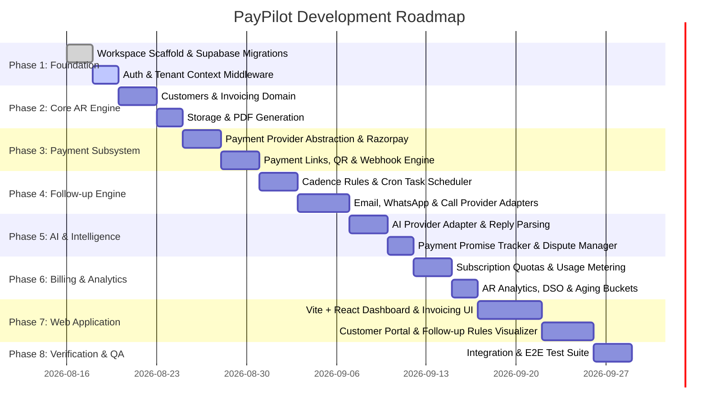

# PayPilot - Phased Implementation Roadmap

This roadmap breaks down the build process into logical, verifiable milestones.

---

## Milestone Breakdown

### Phase 1: Foundation & Data Layer
- [ ] Initialize modular workspace (`client/`, `server/`, `shared/`, `supabase/`, `tests/`).
- [ ] Apply Supabase migration DDL with UUID keys, timestamps, indexes, and full RLS policies.
- [ ] Implement `shared/types` and `shared/validators` using Zod.
- [ ] Implement server auth middleware (`requireAuth`, `requireOrgContext`, `requireRole`).

### Phase 2: Core Accounts Receivable Engine
- [ ] Implement CRUD for Organizations, Members, and Customers.
- [ ] Implement Invoice management (creation, line items, status machine: `draft` -> `issued` -> `pending` -> `overdue` -> `paid`).
- [ ] Private file storage handling (upload invoices, generate 15-minute signed URLs).
- [ ] Automated AR Aging calculation (0-30, 31-60, 61-90, 90+ days).

### Phase 3: Payment Infrastructure
- [ ] Create `IPaymentProvider` interface and implement `RazorpayPaymentProvider`.
- [ ] Implement dynamic payment link generation with UPI QR codes.
- [ ] Build idempotent webhook receiver (`public.webhook_events`) with HMAC SHA-256 validation.
- [ ] Automated payment reconciliation (mark invoice `paid` / `partially_paid`, cancel pending follow-ups).

### Phase 4: Autonomous Follow-Up Engine
- [ ] Build `FollowUpRulesEngine` supporting relative offset rules (`-3d`, `0d`, `+3d`, `+7d`, `+14d`).
- [ ] Implement `IEmailProvider` (Resend/SendGrid).
- [ ] Implement `IWhatsAppProvider` (Meta Cloud API / Twilio).
- [ ] Implement `ICallProvider` (Twilio Voice IVR).
- [ ] Build async job scheduler (Cron / BullMQ) to evaluate daily overdue invoices and schedule `follow_up_tasks`.
- [ ] Implement circuit breaker (auto-stop follow-up on payment or customer opt-out).

### Phase 5: AI Intelligence, Promises & Disputes
- [ ] Create `IAIProvider` (Google Gemini / OpenAI) with structured output validation.
- [ ] Customer reply ingestion pipeline (email inbound & WhatsApp webhook).
- [ ] Promise-to-Pay (PTP) detection: extract promised date, store in `payment_promises`, pause follow-up until date.
- [ ] Promise verification worker: check if payment arrived on promised date; if not, resume escalation.
- [ ] Dispute management workflow: track open disputes, auto-pause follow-ups, and provide merchant resolution UI.

### Phase 6: Subscriptions, Usage Limits & Analytics
- [ ] SaaS subscription lifecycle management (`subscriptions`).
- [ ] Usage metering middleware (`usage_records`) enforcing limits on WhatsApp, AI calls, and invoices per tier.
- [ ] Real-time AR Analytics API (Total AR, Overdue %, DSO, Recovery Rate, Channel Effectiveness).

### Phase 7: Modern Web Application (React + Vite + Tailwind)
- [ ] Set up React app with Tailwind CSS, Lucide icons, and TanStack Query.
- [ ] Authentication flows (Login, Register, Organization switcher, Member management).
- [ ] Interactive Dashboard with AR metrics, Aging chart, and collection speedometers.
- [ ] Invoices Workspace: Create invoice, upload PDF, view status timeline, generate payment links & QR.
- [ ] Customers Workspace: Debtors table, credit periods, communication log timeline.
- [ ] Follow-up Builder: Visual cadence workflow editor.
- [ ] Disputes & Promises Manager: AI-detected promises and dispute resolution hub.
- [ ] Billing & Subscription portal: Plan upgrades and usage progress bars.

### Phase 8: Testing & Hardening
- [ ] Unit tests for domain models, provider abstractions, and follow-up state transitions.
- [ ] Integration tests for API endpoints, webhook signature verification, and RLS policies.
- [ ] Security audit: IDOR verification, rate limiting stress test, prompt injection boundary test.
